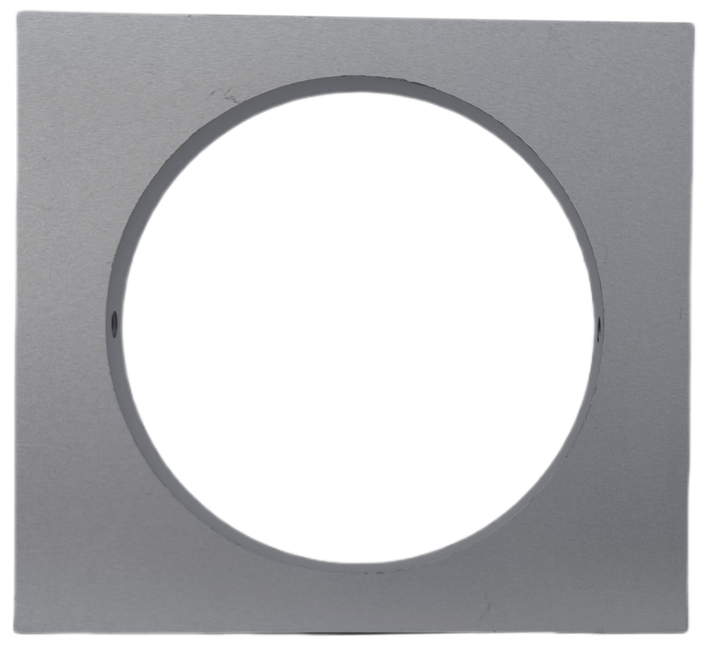
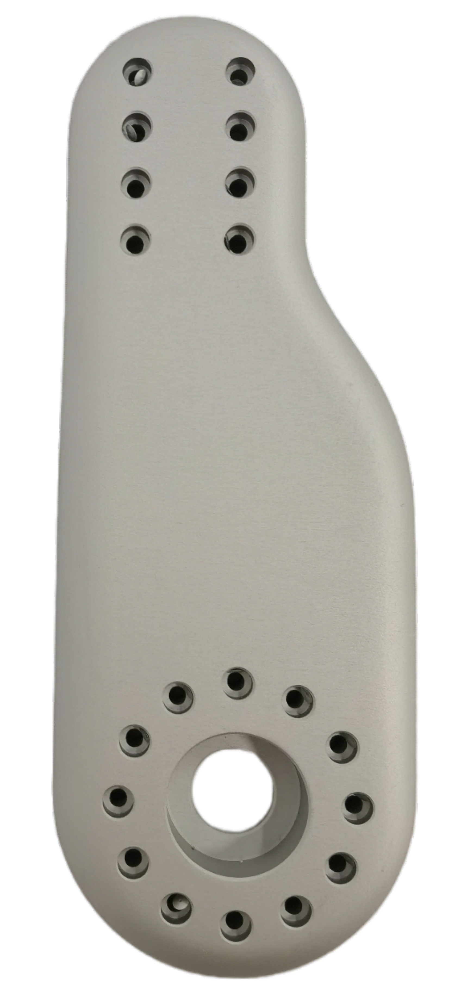
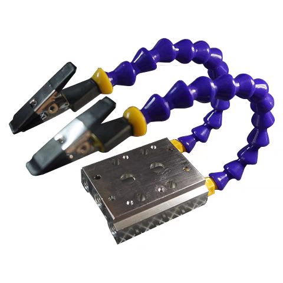

.. OpenPyRo-A1 Docs documentation master file, created by
   sphinx-quickstart on Mon Mar 17 20:33:45 2025.
   You can adapt this file completely to your liking, but it should at least
   contain the root `toctree` directive.

.. title:: OpenPyRo-A1 Docs

Introduction
============
Welcome to the `OpenPyRo-A1 <https://openpyro-a1.github.io/>`_ documentation! This website hosts the hardware assembly guide and usage instructions for our open-source robot.

.. Key Features of OpenPyRo-A1
.. ---------------------------

.. - **Affordability:** Priced at approximately $14,000, the OpenPyRo-A1 offers a cost-effective solution for researchers and developers seeking a dual-arm robotic platform.

.. - **Modular Hardware Design:** Constructed using 3D-printed components and CNC-machined aluminum alloy parts, the robot's modular design facilitates easy assembly, maintenance, and customization.

.. - **Advanced Software Integration:** The Python-based software framework supports VR-based data collection, imitation learning from visual and positional data, and seamless integration with LLMs and VLMs for high-level task planning.

.. - **Bimanual Manipulation:** Equipped with two 7-degree-of-freedom (7-DoF) arms, the OpenPyRo-A1 is capable of performing complex bimanual tasks, including object manipulation, cooking, and collaborative operations.

This assembly guide will provide step-by-step instructions to help you build your OpenPyRo-A1 robot, ensuring a smooth and efficient assembly process.

Hardware Design
---------------

We consider the following three key principles when designing OpenPyRo-A1:

**Low-cost:**
The robotic system is designed to be cost-effective while maintaining high performance. To minimize manufacturing expenses, the structure integrates 3D-printed components for non-load-bearing parts and CNC-machined aluminum alloy for critical structural elements.

**Ease of repair:**
Features a modular design with accessible panels, standardized fasteners, color-coded wiring, and quick-release connections, facilitating straightforward maintenance.

**Scalability:**
Supports modular firmware updates and includes pre-drilled expansion points, allowing seamless integration of new technologies.

.. Control System
.. --------------
.. We developed the distributed teleoperation system based on LCM to control the robot, the whole system design as follows:

.. (Pd Control and Gripper) we run this node to do the pd control, the main work for this node including publish robot state such as joint state, gripper state and calculate the control target and set the motor to the target with a stable frequency.

.. (Meta quest3 node) we run this node to publish the original data comes from VR device, such as head and hand pose with a high frquency.

.. (End effetor node) we run this node to calculate forward kinematic result.

.. (Gripper mapper) we run this code to do the data transformer comes from VR device, with this can be very easy to used in different type gripper

.. (calibration node) we run this node to do the calibration from VR to robot frame, to do the smooth control

.. (IK node) we run this to do the innverse kinematic calculation and set the ik solution to the pd control node to control the motor

Bill of materials (BOM)
============================================

Robot design and procurement resources
--------------------------------------

:download:`Robot design URDF files <_static/urdf_files/openpyro_urdf.zip>`

:download:`Robot design STEP files <_static/step_files/robot_design.STEP.zip>`

.. raw:: html

   

   Joint motors procurement website: 
   <a href="http://www.eyoubot.com/" target="_blank" rel="noopener noreferrer">link</a> 
   Gripper motors procurement website: 
   <a href="https://www.mdmbot.com/" target="_blank" rel="noopener noreferrer">link</a> 
   Accessories procurement website: 
   <a href="https://www.taobao.com/" target="_blank" rel="noopener noreferrer">link</a> 
   CNC Machining website: 
   <a href="https://www.jlc-cnc.com/" target="_blank" rel="noopener noreferrer">link</a> 
   

Motors
------

.. |ph25b_motor| image:: ./_static/images/motors/ph25b.png
   :align: middle
   :width: 100px
   :alt: motor used for waist and chest

.. |ph20b_motor| image:: ./_static/images/motors/ph20b.png
   :align: middle
   :width: 100px
   :alt: motor used for arm

.. |ph17b_motor| image:: ./_static/images/motors/ph17b.png
   :align: middle
   :width: 100px
   :alt: motor used for arm

.. |ph14b_motor| image:: ./_static/images/motors/ph14b.png
   :align: middle
   :width: 100px
   :alt: motor used for arm

.. |ph11b_motor| image:: ./_static/images/motors/ph11b.png
   :align: middle
   :width: 100px
   :alt: motor used for arm

.. csv-table:: material statement for motors
   :header: "Name", "Image", "Quantity", "Notes"
   :widths: 10, 30, 10, 50
   :class: white-background

   "waist and chest", "|ph25b_motor|", "2", "motor model: ph25b"
   "arm motor 1", "|ph20b_motor|", "2", "motor model: ph20b"
   "arm motor 2,3", "|ph17b_motor|", "4", "motor model: ph17b"
   "arm motor 4,5", "|ph14b_motor|", "4", "motor model: ph17b"
   "arm motor 6,7", "|ph11b_motor|", "4", "motor model: ph14b"
   "gripper motor", "|damiao_motor|", "2", "motor model: DM-J4310-2EC"

Body structure components
-------------------------
.. Please download the raw step files here: `sample_project.zip <_static/sample_project.zip>`_

.. |base_plate| image:: ./_static/images/structure_components/base_plate.png
   :align: middle
   :width: 100px
   :alt: base plate that supports the upper body of the robot

.. |waist_rotation| image:: ./_static/images/structure_components/waist_rotation.png
   :align: middle
   :width: 100px
   :alt: support the rotation of the waist

.. |waist_motor_left_fixing_part| image:: ./_static/images/structure_components/waist_motor_left_fixing_part.png
   :align: middle
   :width: 100px
   :alt: used to fix the waist motor

.. |waist_motor_right_fixing_part| image:: ./_static/images/structure_components/waist_motor_right_fixing_part.png
   :align: middle
   :width: 100px
   :alt: used with waist motor fixing plate for waist movement

.. |waist_motor_upper_plate| image:: ./_static/images/structure_components/waist_motor_upper_plate.png
   :align: middle
   :width: 100px
   :alt: matched with the left and right fixing plates of the waist motor

.. |scapular_left| image:: ./_static/images/structure_components/scapular_left.png
   :align: middle
   :width: 100px
   :alt: the shoulder part is used to fix the front and rear chest plates

.. |shoulder_plate_b| image:: ./_static/images/structure_components/shoulder_plate_b.png
   :align: middle
   :width: 100px
   :alt: shoulder motor connection plate

.. |upper_arm| image:: ./_static/images/structure_components/upper_arm.png
   :align: middle
   :width: 100px
   :alt: arm motor 2 and 3 connection component

.. |elbow_left| image:: ./_static/images/structure_components/elbow_left.png
   :align: middle
   :width: 100px
   :alt: arm motor 3 and 4 connection component

.. |elbow_right| image:: ./_static/images/structure_components/elbow_right.png
   :align: middle
   :width: 100px
   :alt: arm motor 3 and 4 connection component

.. |upper_wrist| image:: ./_static/images/structure_components/upper_wrist.png
   :align: middle
   :width: 100px
   :alt: suite for arm motor 5

.. csv-table:: material statement for structure components
   :header: "Name", "Image", "Quantity", "Notes"
   :widths: 10, 30, 10, 50
   :class: white-background

   "base plate", "|base_plate|", "1", "which supports the upper body of the robot"
   "waist rotation", "|waist_rotation|", "1", "support the rotation of the waist"
   "waist left fixing", "|waist_motor_left_fixing_part|", "1", "used to fix the waist motor"
   "waist right fixing", "|waist_motor_right_fixing_part|", "1", "used with waist motor fixing plate"
   "waist upper plate", "|waist_motor_upper_plate|", "1", "matched with the left and right fixing plates"
   "chest plate", "|chest_plate|", "2", "front and rear panels of the torso"
   "scapular left", "|scapular_left|", "1", "used to fix the front and rear chest plates"
   "scapular right", "|scapular_right|", "1", "used to fix the front and rear chest plates"
   "head plate", "|head_plate|", "1", "used for supporting head"
   "shoulder plate a", "|shoulder_plate_a|", "2", "shoulder motor connection plate a"
   "shoulder plate b", "|shoulder_plate_b|", "2", "shoulder motor connection plate b"
   "upper arm", "|upper_arm|", "2", "arm motor 2 and 3 connection component"
   "elbow left", "|elbow_left|", "2", "arm motor 3 and 4 connection component"
   "elbow right", "|elbow_right|", "2", "arm motor 3 and 4 connection component"
   "forearm left", "|forearm_left|", "2", "arm motor 4 and 5 connection component"
   "forearm right", "|forearm_right|", "2", "arm motor 4 and 5 connection component"
   "upper wrist", "|upper_wrist|", "2", "suite for arm motor 5"
   "wrist flange", "|wrist_flange|", "2", "flange for arm motor 5 and 6 connection"

Screws
------

.. |M3X5| image:: ./_static/images/screw/M3X5.png
   :align: middle
   :width: 100px
   :alt: M3X5

.. |M3X6| image:: ./_static/images/screw/M3X6.png
   :align: middle
   :width: 100px
   :alt: M3X6

.. |M3X8| image:: ./_static/images/screw/M3X8.png
   :align: middle
   :width: 100px
   :alt: M3X8

.. |M3X10| image:: ./_static/images/screw/M3X10.png
   :align: middle
   :width: 100px
   :alt: M3X10

.. |M3X12| image:: ./_static/images/screw/M3X12.png
   :align: middle
   :width: 100px
   :alt: M3X12

.. |M3X14| image:: ./_static/images/screw/M3X14.png
   :align: middle
   :width: 100px
   :alt: M3X14

.. |M3X16| image:: ./_static/images/screw/M3X16.png
   :align: middle
   :width: 100px
   :alt: M3X16

.. |M3X18| image:: ./_static/images/screw/M3X18.png
   :align: middle
   :width: 100px
   :alt: M3X18

.. |M3X20| image:: ./_static/images/screw/M3X20.png
   :align: middle
   :width: 100px
   :alt: M3X20

.. |M3X22| image:: ./_static/images/screw/M3X22.png
   :align: middle
   :width: 100px
   :alt: M3X22

.. |M3X25| image:: ./_static/images/screw/M3X25.png
   :align: middle
   :width: 100px
   :alt: M3X25

.. |M3X30| image:: ./_static/images/screw/M3X30.png
   :align: middle
   :width: 100px
   :alt: M3X30

.. |M3X35| image:: ./_static/images/screw/M3X35.png
   :align: middle
   :width: 100px
   :alt: M3X35

.. |M3X70| image:: ./_static/images/screw/M3X70.png
   :align: middle
   :width: 100px
   :alt: M3X70

.. |M4X10| image:: ./_static/images/screw/M4X10.png
   :align: middle
   :width: 100px
   :alt: M4X10

.. |M4X12| image:: ./_static/images/screw/M4X12.png
   :align: middle
   :width: 100px
   :alt: M4X12

.. |M4X16| image:: ./_static/images/screw/M4X16.png
   :align: middle
   :width: 100px
   :alt: M4X16

.. |M4X30| image:: ./_static/images/screw/M4X30.png
   :align: middle
   :width: 100px
   :alt: M4X30

.. |M5X10| image:: ./_static/images/screw/M5X10.png
   :align: middle
   :width: 100px
   :alt: M5X10

.. |M5X20| image:: ./_static/images/screw/M5X20.png
   :align: middle
   :width: 100px
   :alt: M5X20

.. |M6X22| image:: ./_static/images/screw/M6X22.png
   :align: middle
   :width: 100px
   :alt: M6X22

.. |M6X30| image:: ./_static/images/screw/M6X30.png
   :align: middle
   :width: 100px
   :alt: M6X30

.. |M8X20| image:: ./_static/images/screw/M8X20.png
   :align: middle
   :width: 100px
   :alt: M8X20

.. csv-table:: material statement for screws
   :header: "Name", "Image", "Quantity"
   :class: white-background

   "M3X5", "|M3X5|", "100"
   "M3X6", "|M3X6|", "100"
   "M3X8", "|M3X8|", "100"
   "M3X10", "|M3X10|", "100"
   "M3X12", "|M3X12|", "100"
   "M3X14", "|M3X14|", "100"
   "M3X16", "|M3X16|", "100"
   "M3X18", "|M3X18|", "100"
   "M3X20", "|M3X20|", "100"
   "M3X22", "|M3X22|", "100"
   "M3X25", "|M3X25|", "100"
   "M3X30", "|M3X30|", "100"
   "M3X35", "|M3X35|", "100"
   "M3X45", "|M3X45|", "100"
   "M3X70", "|M3X70|", "100"
   "M4X10", "|M4X10|", "100"
   "M4X12", "|M4X12|", "100"
   "M4X16", "|M4X16|", "100"
   "M4X30", "|M4X30|", "100"
   "M4X45", "|M4X45|", "100"
   "M5X10", "|M5X10|", "100"
   "M5X20", "|M5X20|", "100"
   "M6X12", "|M6X12|", "100"
   "M6X22", "|M6X22|", "100"
   "M6X30", "|M6X30|", "100"
   "M8X20", "|M8X20|", "100"

Pins
------

.. |M4X6| image:: ./_static/images/pins/M4X6.png
   :align: middle
   :width: 100px
   :alt: M4X6

.. csv-table:: material statement for pins
   :header: "Name", "Image", "Quantity"
   :class: white-background

   "M4X6", "|M4X6|", "20"

Mechanical components
---------------------

.. |XRU2512_bearing| image:: ./_static/images/mechanical_components/XRU2512_bearing.png
   :align: middle
   :width: 100px

.. |S6000ZZ_bearing| image:: ./_static/images/mechanical_components/S6000ZZ_bearing.png
   :align: middle
   :width: 100px

.. |10_mm_bearing_retaining_ring| image:: ./_static/images/mechanical_components/10_mm_bearing_retaining_ring.png
   :align: middle
   :width: 100px

   

.. csv-table:: material statement for mechanical components
   :header: "Name", "Image", "Quantity"
   :class: white-background

   "bearing (RU66)", "|RU66_bearing|", "2"
   "bearing (XRU2512)", "|XRU2512_bearing|", "2"
   "bearing (S6000ZZ)", "|S6000ZZ_bearing|", "2"
   "bearing retaining ring (10mm)", "|10_mm_bearing_retaining_ring|", "2"

Tools
-----

.. |torque_wrench| image:: ./_static/images/tools/torque_wrench.png
   :align: middle
   :width: 100px

.. |needle_nose_pliers| image:: ./_static/images/tools/needle_nose_pliers.png
   :align: middle
   :width: 100px

.. |torque_screwdriver| image:: ./_static/images/tools/torque_screwdriver.png
   :align: middle
   :width: 100px

.. |can_net| image:: ./_static/images/tools/can_net.png
   :align: middle
   :width: 100px
   :alt: connect to motor for communication

.. |ark_kinfe| image:: ./_static/images/tools/ark_kinfe.png
   :align: middle
   :width: 100px

.. |solder_paste_1| image:: ./_static/images/tools/solder_paste_1.png
   :align: middle
   :width: 100px

.. |solder_paste_2| image:: ./_static/images/tools/solder_paste_2.png
   :align: middle
   :width: 100px

.. |heat_gun| image:: ./_static/images/tools/heat_gun.png
   :align: middle
   :width: 100px

.. |electric_soldering_iron| image:: ./_static/images/tools/electric_soldering_iron.png
   :align: middle
   :width: 100px

.. |electric_drill| image:: ./_static/images/tools/electric_drill.png
   :align: middle
   :width: 100px

.. |file| image:: ./_static/images/tools/file.png
   :align: middle
   :width: 100px

.. |tweezers| image:: ./_static/images/tools/tweezers.png
   :align: middle
   :width: 100px

.. |flexible_shaft_ratchet_screwdriver| image:: ./_static/images/tools/flexible_shaft_ratchet_screwdriver.png
   :align: middle
   :width: 100px

.. |lube| image:: ./_static/images/tools/lube.png
   :align: middle
   :width: 100px

.. |screwdriver| image:: ./_static/images/tools/screwdriver.png
   :align: middle
   :width: 100px

.. |multimeter| image:: ./_static/images/tools/multimeter.png
   :align: middle
   :width: 100px

.. |scissor| image:: ./_static/images/tools/scissor.png
   :align: middle
   :width: 100px

.. csv-table:: material statement for tools
   :header: "Name", "Image", "Quantity"
   :class: white-background

   "screw glue", "|screw_glue|", "1"
   "hexagon wrench", "|hexagon_wrench|", "1"
   "torque wrench", "|torque_wrench|", "1"
   "vise", "|vise|", "1"
   "wire stripper", "|wire_strippers|", "1"
   "wire stripper", "|multifunctional_wire_stripper|", "1"
   "needle nose pliers", "|needle_nose_pliers|", "1"
   "locking pilers", "|locking_pliers|", "1"
   "diagonal pliers", "|diagonal_cutting_pliers|", "1"
   "soldering fixture", "|soldering_station_fixture|", "1"
   "torque screwdriver", "|torque_screwdriver|", "1"
   "usb red can", "|usb_red_can|", "1"
   "can net", "|can_net|", "1"
   "power", "|power|", "1"
   "ark kinfe", "|ark_kinfe|", "1"
   "solder paste", "|solder_paste_1|", "1"
   "solder paste", "|solder_paste_2|", "1"
   "heat gun", "|heat_gun|", "1"
   "electric soldering iron", "|electric_soldering_iron|", "1"
   "electric drill", "|electric_drill|", "1"
   "file", "|file|", "1"
   "tweezers", "|tweezers|", "1"
   "flexible shaft ratchet screwdriver", "|flexible_shaft_ratchet_screwdriver|", "1"
   "lube", "|lube|", "1"
   "screwdriver", "|screwdriver|", "1"
   "multimeter", "|multimeter|", "1"
   "scissor", "|scissor|", "1"
 

Accessories
-----------

.. |XT30U_m| image:: ./_static/images/accessories/XT30U_m.png
   :align: middle
   :width: 100px

.. |XT30U_f| image:: ./_static/images/accessories/XT30U_f.png
   :align: middle
   :width: 100px

.. |XT60U_m| image:: ./_static/images/accessories/XT60U_m.png
   :align: middle
   :width: 100px

.. |XT60U_f| image:: ./_static/images/accessories/XT60U_f.png
   :align: middle
   :width: 100px

.. |power_wire| image:: ./_static/images/accessories/power_wire.png
   :align: middle
   :width: 100px

.. |can_wire| image:: ./_static/images/accessories/can_wire.png
   :align: middle
   :width: 100px

.. |vertical_snap_ring_holder| image:: ./_static/images/accessories/vertical_snap_ring_holder(GH1.25_3P).png
   :align: middle
   :width: 100px

.. |can_base_3d_print| image:: ./_static/images/accessories/can_base_3d_print.png
   :align: middle
   :width: 100px

.. |power_base_3d_print| image:: ./_static/images/accessories/power_base_3d_print.png
   :align: middle
   :width: 100px

.. |can_board| image:: ./_static/images/accessories/can_board.png
   :align: middle
   :width: 100px

.. |ribbon| image:: ./_static/images/accessories/ribbon.png
   :align: middle
   :width: 100px

.. |amphenol_connector| image:: ./_static/images/accessories/amphenol_connector.png
   :align: middle
   :width: 100px

.. |DC_voltage_reduction_module| image:: ./_static/images/accessories/DC_voltage_reduction_module.png
   :align: middle
   :width: 100px

.. |type-c_16P| image:: ./_static/images/accessories/type-c_16P.png
   :align: middle
   :width: 100px

.. |anti-slip| image:: ./_static/images/accessories/anti-slip.png
   :align: middle
   :width: 100px

.. |magnet_ring| image:: ./_static/images/accessories/magnet_ring.png
   :align: middle
   :width: 100px
   

.. csv-table:: material statement for accessories
   :header: "Name", "Image", "Quantity"
   :class: white-background

   "XT30U m", "|XT30U_m|", "10"
   "XT30U f", "|XT30U_f|", "10"
   "XT60U m", "|XT60U_m|", "10"
   "XT60U f", "|XT60U_f|", "10"
   "cold pressed round terminal", "|cold_pressed_round_terminal|", "50"
   "plastic shell", "|plastic_shell|", "50"
   "lead free solder wire", "|lead_free_solder_wire|", "1"
   "reed", "|reed|", "1"
   "silicone wire", "|silicone_wire|", "1"
   "power wire", "|power_wire|", "1"
   "can wire", "|can_wire|", "20"
   "vertical snap ring holder (GH1.25 3P)", "|vertical_snap_ring_holder|", "20"
   "can base", "|can_base_3d_print|", "2"
   "power base", "|power_base_3d_print|", "2"
   "can board", "|can_board|", "2"
   "ribbon", "|ribbon|", "100"
   "amphenol connector", "|amphenol_connector|", "10"
   "DC voltage reduction module", "|DC_voltage_reduction_module|", "10"
   "type-c 16P", "|type-c_16P|", "5"
   "anti-slip", "|anti-slip|", "1"
   "magnet ring", "|magnet_ring|", "10"
   

Power system
============

Power wire
-----------
The power module provides 48V voltage, making power wire for power.

Material statement
++++++++++++++++++

.. csv-table:: material statement for power system
   :header: "Name", "Image", "Quantity", "Notes"
   :widths: 10, 30, 10, 50
   :class: white-background

   "power", "|power|", "1", "provide 48V voltage"
   "XT30U m connector", "|XT30U_m|", "1", "used for lithium battery plug"
   "cold pressed round terminal", "|cold_pressed_round_terminal|", "1", "used for electrical connection"
   "wire strippers", "|wire_strippers|", "1", "stripping wires"
   "diagonal pliers", "|diagonal_cutting_pliers|", "1", "cutting wires"
   "power wire", "|power_wire|", "1", "power wire material"

Assemble video(4X speed)
++++++++++++++++++++++++

.. video:: ./_static/videos/power_wire.mp4
   :width: 100%
   :autoplay:
   :loop:
   :muted:

CAN system
============================================

CAN wire
-----------
Produce CAN signal wire for communication between CAN device and motors.

Material statement
++++++++++++++++++

.. csv-table:: material statement for can wire
   :header: "Name", "Image", "Quantity", "Notes"
   :widths: 10, 30, 10, 50
   :class: white-background

   "reed", "|reed|", "1", ""
   "silicone wire", "|silicone_wire|", "1", ""
   "wire strippers", "|wire_strippers|", "1", "stripping wires"
   "wire stripper", "|multifunctional_wire_stripper|", "1", "stripping wires"
   "diagonal pliers", "|diagonal_cutting_pliers|", "1", "cutting wires"

Assemble video(4X speed)
++++++++++++++++++++++++

.. video:: ./_static/videos/signal_wire.mp4
   :width: 100%
   :autoplay:
   :loop:
   :muted:

Integration
============================================

This page will guide you through the process of assembling all components into the robot.

Waist motor
-----------
The waist motor provides the robot with the ability to rotate left and right. Please follow the instructions to assemble.

Material statement
++++++++++++++++++

.. csv-table:: material statement for waist
   :header: "Name", "Image", "Quantity", "Notes"
   :widths: 10, 30, 10, 50
   :class: white-background

   "waist motor", "|ph25b_motor|", "2", "motor model: ph25b, please `see <#>`_"
   "base plate", "|base_plate|", "1", "support the upper body of the robot"
   "hexagon wrench", "|hexagon_wrench|", "1", "used to tighten the screws"
   "torque wrench", "|torque_wrench|", "1", "set torque to avoid screw stripping"
   "M8X20", "|M8X20|", "6", "fix plate and table"
   "M4X45", "|M4X45|", "13", "fix waist motor and plate"

Assemble video(4X speed)
++++++++++++++++++++++++

.. video:: ./_static/videos/waist.mp4
   :width: 100%
   :autoplay:
   :loop:
   :muted:

Chest motor
-----------
The chest provide with one freedom to turn up and down, what we need as follows. Please follow the instructions to assemble.

Material statement
++++++++++++++++++

.. csv-table:: material statement for chest
   :header: "Name", "Image", "Quantity", "Notes"
   :widths: 10, 30, 10, 50
   :class: white-background

   "chest motor", "|ph25b_motor|", "2", "motor model: ph25b, please `see <#>`_"
   "waist left fixing", "|waist_motor_left_fixing_part|", "1", "used to fix the waist motor"
   "waist right fixing", "|waist_motor_right_fixing_part|", "1", "used with waist motor fixing plate"
   "waist upper plate", "|waist_motor_upper_plate|", "1", "matched with the left and right fixing plates"
   "waist rotation", "|waist_rotation|", "1", "support the rotation of the waist"
   "hexagon wrench", "|hexagon_wrench|", "1", "used to tighten the screws"
   "bearing(RU66)", "|RU66_bearing|", "1", "used for connecting chest motor and structural parts"
   "M4X30", "|M4X30|", "32", "fix components"
   "M4X45", "|M4X45|", "12", "fix components"
   "M4X16", "|M4X16|", "16", "fix components"
   "M6X12", "|M6X12|", "6", "fix components"

Assemble video(4X speed)
++++++++++++++++++++++++

Firstly, assemble the chest motor and its components.

.. video:: ./_static/videos/chest.mp4
   :width: 100%
   :autoplay:
   :loop:
   :muted:

Secondly, assemble chest motor turntable components.

.. video:: ./_static/videos/chest_turnable.mp4
   :width: 100%
   :autoplay:
   :loop:
   :muted:

.. ##################################################
.. ############## right shoulder arm 0 ##############
.. ##################################################

Right shoulder motor 0
----------------------
From the perspective of the robot, the first motor of the right arm, what we need as follows. Please follow the instructions to assemble.

Material statement
++++++++++++++++++

.. csv-table:: material statement for right shoulder 0
   :header: "Name", "Image", "Quantity", "Notes"
   :widths: 10, 30, 10, 50
   :class: white-background

   "scapular_right", "|scapular_right|", "1", "used to fix the front and rear chest plates"
   "arm motor 1", "|ph20b_motor|", "1", "motor model: ph20b"
   "shoulder plate a", "|shoulder_plate_a|", "1", "shoulder motor connection plate a"
   "M6X22", "|M6X22|", "8", "fix scapular right and chest plates"
   "M3X45", "|M3X45|", "8", "fix right shoulder motor and right scapular"
   "M3X30", "|M3X30|", "14", "fix shoulder plate a and right motor"
   "torque wrench", "|torque_wrench|", "1", "set torque to avoid screw stripping"
   "hexagon wrench", "|hexagon_wrench|", "1", "used to tighten the screws"

Assemble video(4X speed)
++++++++++++++++++++++++

.. video:: ./_static/videos/right_motor_0.mp4
   :width: 100%
   :autoplay:
   :loop:
   :muted:

.. #########################################################
.. ############## waist motor zero adjustment ##############
.. #########################################################

Waist motor zero adjustment
---------------------------
The waist motor is adjusted to its zero position through software.

Material Statement
++++++++++++++++++

.. csv-table:: material statement for waist motor zero position adjustment
   :header: "Name", "Image", "Quantity", "Notes"
   :widths: 10, 30, 10, 50
   :class: white-background

   "usb red can", "|usb_red_can|", "1", "connect to motor for testing"
   "M3X30", "|M3X30|", "1", "fix support plate and waist motor"
   "locking pilers", "|locking_pliers|", "1", "pulling out pins"
   "power", "|power|", "1", "provide 48V voltage"
   "power wire", "|power_wire|", "1", "power wire material"

Assemble video(4X speed)
++++++++++++++++++++++++

.. video:: ./_static/videos/waist_motor_zero_adjustment.mp4
   :width: 100%
   :autoplay:
   :loop:
   :muted:

.. ############################################################
.. ############## shoulder motor zero adjustment ##############
.. ############################################################

Shoulder motor zero adjustment
------------------------------
The shoulder motor is adjusted to its zero position through software.

Material Statement
++++++++++++++++++

.. csv-table:: material statement for shoulder motor zero position adjustment
   :header: "Name", "Image", "Quantity", "Notes"
   :widths: 10, 30, 10, 50
   :class: white-background

   "usb red can", "|usb_red_can|", "1", "connect to motor for testing"
   "M3X30", "|M3X30|", "1", "fix support plate and waist motor"
   "locking pilers", "|locking_pliers|", "1", "pulling out pins"
   "power", "|power|", "1", "provide 48V voltage"
   "power wire", "|power_wire|", "1", "power wire material"

Assemble video(4X speed)
++++++++++++++++++++++++

.. video:: ./_static/videos/shoulder_motor_zero_adjustment.mp4
   :width: 100%
   :autoplay:
   :loop:
   :muted:

.. ############################################################
.. ############## ph14b motor adjustment ##############
.. ############################################################

Ph14b motor adjustment
----------------------
Modify the wiring of the motor in ph14b.

Material Statement
++++++++++++++++++

.. csv-table:: material statement for modifying the wiring of the motor in ph14b
   :header: "Name", "Image", "Quantity"
   :class: white-background

   "can wire", "|can_wire|", "1"
   "ph14b motor", "|ph14b_motor|", "1"
   "XT30U m connector 2", "|XT30U_f|", "1"
   "hexagon wrench", "|hexagon_wrench|", "1"
   "ark kinfe", "|ark_kinfe|", "1"
   "wire stripper", "|wire_strippers|", "1"
   "solder paste", "|solder_paste_1|", "1"
   "needle nose pliers", "|needle_nose_pliers|", "1"
   "plastic shell", "|plastic_shell|", "50"
   "diagonal pliers", "|diagonal_cutting_pliers|", "1"
   "heat gun", "|heat_gun|", "1"
   "soldering fixture", "|soldering_station_fixture|", "1"
   "lead free solder wire", "|lead_free_solder_wire|", "1"
   "power wire", "|power_wire|", "1"
   "electric soldering iron", "|electric_soldering_iron|", "1"
   "silicone wire", "|silicone_wire|", "1"
   "reed", "|reed|", "5"
   "electric drill", "|electric_drill|", "1"
   "file", "|file|", "1"
   "tweezers", "|tweezers|", "1"

Assemble video(4X speed)
++++++++++++++++++++++++

.. video:: ./_static/videos/ph14b_motor_adjustment.mp4
   :width: 100%
   :autoplay:
   :loop:
   :muted:

.. ##################################################
.. ############## right shoulder arm 1 ##############
.. ##################################################

Right shoulder motor 1
----------------------
Please follow the instructions to assemble.

Material statement
++++++++++++++++++

.. csv-table:: material statement for right shoulder 1
   :header: "Name", "Image", "Quantity"
   :class: white-background

   "M3X14", "|M3X14|", "8"
   "M3X20", "|M3X20|", "8"
   "M3X25", "|M3X25|", "8"
   "M3X35", "|M3X35|", "8"
   "M5X20", "|M5X20|", "8"
   "bearing(XRU2512)", "|XRU2512_bearing|", "2"
   "hexagon wrench", "|hexagon_wrench|", "1"
   "torque wrench", "|torque_wrench|", "1"
   "upper arm", "|upper_arm|", "1"
   "torque screwdriver", "|torque_screwdriver|", "1"
   "shoulder plate b", "|shoulder_plate_b|", "1"

Assemble video(4X speed)
++++++++++++++++++++++++

.. video:: ./_static/videos/right_motor_1.mp4
   :width: 100%
   :autoplay:
   :loop:
   :muted:

.. ##################################################
.. ############## right shoulder arm 2 ##############
.. ##################################################

Right shoulder motor 2
----------------------
Please follow the instructions to assemble.

Material statement
++++++++++++++++++

.. csv-table:: material statement for right shoulder 2
   :header: "Name", "Image", "Quantity"
   :class: white-background

   "M3X12", "|M3X12|", "8"
   "M3X16", "|M3X16|", "8"
   "M3X22", "|M3X22|", "8"
   "M3X30", "|M3X30|", "8"
   "M3X70", "|M3X70|", "8"
   "motor", "|ph14b_motor|", "1"
   "flexible shaft ratchet screwdriver", "|flexible_shaft_ratchet_screwdriver|", "1"
   "hexagon wrench", "|hexagon_wrench|", "1"
   "forearm left", "|forearm_left|", "1" 
   "forearm right", "|forearm_right|", "1"
   "wrist flange", "|wrist_flange|", "1"
   "torque screwdriver", "|torque_screwdriver|", "1"
   "elbow right", "|elbow_right|", "1"
   "elbow left", "|elbow_left|", "1"
   "lube", "|lube|", "1"
   "bearing (S6000ZZ)", "|S6000ZZ_bearing|", "1"
   "bearing retaining ring (10mm)", "|10_mm_bearing_retaining_ring|", "1"

   

Assemble video(4X speed)
++++++++++++++++++++++++

.. video:: ./_static/videos/right_motor_2.mp4
   :width: 100%
   :autoplay:
   :loop:
   :muted:

.. ############################################
.. ############## can data board ##############
.. ############################################

Can data board
----------------------
Please follow the instructions to assemble.

Material statement
++++++++++++++++++

.. csv-table:: material statement for can data board
   :header: "Name", "Image", "Quantity"
   :class: white-background

   "vertical snap ring holder (GH1.25 3P)", "|vertical_snap_ring_holder|", "1"
   "can net", "|can_net|", "1"
   "can base", "|can_base_3d_print|", "1"
   "can board", "|can_board|", "1"
   "ribbon", "|ribbon|", "10"
   "solder paste", "|solder_paste_2|", "1"
   "M3X5", "|M3X5|", "10"
   "wire stripper", "|wire_strippers|", "1"
   "can wire", "|can_wire|", "20"
   "diagonal pliers", "|diagonal_cutting_pliers|", "1"
   "heat gun", "|heat_gun|", "1"
   "silicone wire", "|silicone_wire|", "1"
   "screwdriver", "|screwdriver|", "1"
   "tweezers", "|tweezers|", "1"

Assemble video(4X speed)
++++++++++++++++++++++++

.. video:: ./_static/videos/can_data_board.mp4
   :width: 100%
   :autoplay:
   :loop:
   :muted:

.. ############################################
.. ############## power board ##############
.. ############################################

Power board
----------------------
Please follow the instructions to assemble.

Material statement
++++++++++++++++++

.. csv-table:: material statement for power board
   :header: "Name", "Image", "Quantity"
   :class: white-background

   "amphenol connector", "|amphenol_connector|", "1"
   "DC voltage reduction module", "|DC_voltage_reduction_module|", "10"
   "multimeter", "|multimeter|", "1"
   "M3X10", "|M3X10|", "5"
   "M3X14", "|M3X14|", "5"
   "M4X10", "|M4X10|", "5"
   "type-c 16P", "|type-c_16P|", "1"
   "XT30U m", "|XT30U_m|", "1"
   "XT60U m", "|XT60U_m|", "1"
   "XT60U f", "|XT60U_f|", "1"
   "power base", "|power_base_3d_print|", "1"
   "cold pressed round terminal", "|cold_pressed_round_terminal|", "5"
   "wire stripper", "|wire_strippers|", "1"
   "diagonal pliers", "|diagonal_cutting_pliers|", "1"
   "heat gun", "|heat_gun|", "1"
   "soldering fixture", "|soldering_station_fixture|", "1"
   "lead free solder wire", "|lead_free_solder_wire|", "1"
   "solder paste", "|solder_paste_1|", "1"
   "power", "|power|", "1"
   "power wire", "|power_wire|", "1"
   "electric soldering iron", "|electric_soldering_iron|", "1"
   "vise", "|vise|", "1"
   "screwdriver", "|screwdriver|", "1"

Assemble video(4X speed)
++++++++++++++++++++++++

.. video:: ./_static/videos/power_board.mp4
   :width: 100%
   :autoplay:
   :loop:
   :muted:

.. ###########################################
.. ############## right gripper ##############
.. ###########################################

Right gripper
----------------------
Please follow the instructions to assemble.

Material statement
++++++++++++++++++

.. csv-table:: material statement for right gripper
   :header: "Name", "Image", "Quantity"
   :class: white-background

   "hexagon wrench", "|hexagon_wrench|", "1"
   "scissor", "|scissor|", "1"
   "lube", "|lube|", "1"
   "M4X6", "|M4X6|", "4"
   "gripper motor", "|damiao_motor|", "1"

Assemble video(4X speed)
++++++++++++++++++++++++

.. video:: ./_static/videos/right_gripper.mp4
   :width: 100%
   :autoplay:
   :loop:
   :muted:

.. ##################################################
.. ############## left shoulder arm 0 ##############
.. ##################################################

Left shoulder motor 0
----------------------
Please follow the instructions to assemble.

Material statement
++++++++++++++++++

.. csv-table:: material statement for right shoulder 0
   :header: "Name", "Image", "Quantity"
   :class: white-background

   "waist left fixing", "|waist_motor_left_fixing_part|", "1"
   "waist right fixing", "|waist_motor_right_fixing_part|", "1"
   "arm motor 1", "|ph20b_motor|", "1"
   "M3X30", "|M3X30|", "8"
   "M3X45", "|M3X45|", "8"
   "M6X22", "|M6X22|", "8"
   "scapular right", "|scapular_right|", "1"
   "hexagon wrench", "|hexagon_wrench|", "1"
   "torque wrench", "|torque_wrench|", "1"
   "torque screwdriver", "|torque_screwdriver|", "1"
   "shoulder plate a", "|shoulder_plate_a|", "1"
   "shoulder plate b", "|shoulder_plate_b|", "1"

Assemble video(4X speed)
++++++++++++++++++++++++

.. video:: ./_static/videos/left_motor_0.mp4
   :width: 100%
   :autoplay:
   :loop:
   :muted:

.. ##################################################
.. ############## left shoulder arm 1 ##############
.. ##################################################

Left shoulder motor 1
----------------------
Please follow the instructions to assemble.

Material statement
++++++++++++++++++

.. csv-table:: material statement for left shoulder 1
   :header: "Name", "Image", "Quantity"
   :class: white-background

   "M3X14", "|M3X14|", "8"
   "M3X20", "|M3X20|", "8"
   "M3X25", "|M3X25|", "8"
   "M3X35", "|M3X35|", "8"
   "M5X20", "|M5X20|", "8"
   "arm motor 2,3", "|ph17b_motor|", "2"
   "bearing (XRU2512)", "|XRU2512_bearing|", "1"
   "hexagon wrench", "|hexagon_wrench|", "1"
   "torque wrench", "|torque_wrench|", "1"
   "upper arm", "|upper_arm|", "1"
   "torque screwdriver", "|torque_screwdriver|", "1"
   "can wire", "|can_wire|", "6"
   "shoulder plate b", "|shoulder_plate_b|", "1"

Assemble video(4X speed)
++++++++++++++++++++++++

.. video:: ./_static/videos/left_motor_1.mp4
   :width: 100%
   :autoplay:
   :loop:
   :muted:

.. ##################################################
.. ############## left shoulder arm 2 ##############
.. ##################################################

Left shoulder motor 2
----------------------
Please follow the instructions to assemble.

Material statement
++++++++++++++++++

.. csv-table:: material statement for left shoulder 2
   :header: "Name", "Image", "Quantity"
   :class: white-background

   "M3X12", "|M3X12|", "8"
   "M3X16", "|M3X16|", "8"
   "M3X18", "|M3X18|", "8"
   "M3X22", "|M3X22|", "8"
   "M3X30", "|M3X30|", "8"
   "M3X70", "|M3X70|", "8"
   "arm motor 4,5", "|ph14b_motor|", "4", "motor model: ph17b"
   "flexible shaft ratchet screwdriver", "|flexible_shaft_ratchet_screwdriver|", "1"
   "hexagon wrench", "|hexagon_wrench|", "1"
   "forearm left", "|forearm_left|", "1"
   "forearm right", "|forearm_right|", "1"
   "upper wrist", "|upper_wrist|", "1"
   "wrist flange", "|wrist_flange|", "1"
   "elbow left", "|elbow_left|", "1"
   "elbow right", "|elbow_right|", "1"
   "lube", "|lube|", "1"
   "bearing (S6000ZZ)", "|S6000ZZ_bearing|", "2"
   "bearing retaining ring (10mm)", "|10_mm_bearing_retaining_ring|", "1"

Assemble video(4X speed)
++++++++++++++++++++++++

.. video:: ./_static/videos/left_motor_2.mp4
   :width: 100%
   :autoplay:
   :loop:
   :muted:

.. ###########################################
.. ############## left gripper ##############
.. ###########################################

Left gripper
----------------------
Please follow the instructions to assemble.

Material statement
++++++++++++++++++

.. csv-table:: material statement for left gripper
   :header: "Name", "Image", "Quantity"
   :class: white-background

   "hexagon wrench", "|hexagon_wrench|", "1"
   "scissor", "|scissor|", "1"
   "lube", "|lube|", "1"
   "M4X6", "|M4X6|", "4"
   "gripper motor", "|damiao_motor|", "1"

Assemble video(4X speed)
++++++++++++++++++++++++

.. video:: ./_static/videos/left_gripper.mp4
   :width: 100%
   :autoplay:
   :loop:
   :muted:

.. ##########################################
.. ############## wire tidy up ##############
.. ##########################################

Wire tidy up
----------------------
Please follow the instructions to assemble.

Material statement
++++++++++++++++++

.. csv-table:: material statement for wire tidy up
   :header: "Name", "Image", "Quantity"
   :class: white-background

   "M6X30", "|M6X30|", "10"
   "hexagon wrench", "|hexagon_wrench|", "1"
   "magnet ring", "|magnet_ring|", "10"

Assemble video(4X speed)
++++++++++++++++++++++++

.. video:: ./_static/videos/wire_tidy_up.mp4
   :width: 100%
   :autoplay:
   :loop:
   :muted:
